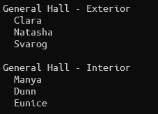
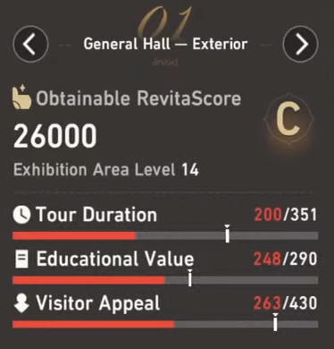
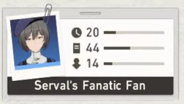
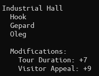

# Pela CLI
## Overview
Pela CLI is an assistant appointment finder for Honkai Star Rail's Everwinter City Museum Ledger of Curiosities event.

## Prerequisites
* .NET 7.0
* CSV file containing areas data (see: [Creating Areas CSV file](#areas-csv-file))
* CSV file containing assistants data (see: [Creating Assistants CSV file](#assistants-csv-file))

## Running the Project
1. Clone this project locally
2. Restore dependencies
```bash
dotnet restore
```
3. Run the executable
```bash
dotnet run
    --project src/Pela.Cli
    --areas /path/to/areas.csv
    --assistants /path/to/assistants.csv
```

It will show an output similar to this:



## Creating the CSV files
### Areas CSV file
The Areas CSV file lists the current state of the unlocked areas in the museum. It consists of 5 columns:
* Name of the area
* Tour Duration needed to reach quota
* Educational Value needed to reach quota
* Visitor Appeal needed to reach quota 
* [Override value](#search-order-override) used for special cases. Keep as 0 by default.

To calculate the value needed to reach quota:
1. **Remove all assigned assistants**
2. **Subtract the quota value to the current value**

Take this particular state for example:



For Tour Duration, quota value is 351 and current value is 200. Therefore, the value needed to reach quota is **351 - 200 = 151**.

An example Areas CSV file would be:
```csv
General Hall - Exterior,151,42,167,0
General Hall - Interior,220,160,90,0
```

### Assistants CSV file
The Assistants CSV file is a list of the currently unlocked assistants. It consists of 4 colums:
* Name of the assistant
* Tour Duration
* Educational Value
* Visitor Appeal

To get the values, copy the values written in the assistant's card. For example, Serval's Fanatic Fan's card will show something like this:



In this case, Tour Duration is 20, Educational Value is 44, and Visitor Appeal is 14.

An example Assistants CSV file would be:
```csv
Pela,30,30,30
Amo,40,8,30
Serval's Fanatic Fan,20,44,14
Elaine,26,26,26
```

## Others
### Area Modifications
Sometimes, the finder will show a Modifications subsection below the suggested assistants.



This means that in the most optimal scenario, there is no possible combination of assistants that can satisfy the current quotas for this area.

As such, it suggests additional modifications that will allow this area to reach the needed values.

In the example above, the finder recommends:
* Upgrading Tour Duration once (an upgrade gives +10 value)
* Upgrading Visitor Appeal once

### Search Order Override
Sometimes, it might not be possible to follow the modification recommendations. It might be because the upgrade is too expensive or that the max upgrade is already reached. 

In those cases, the override column in the Areas CSV file can be used to prioritize the assistant search for a certain area.

```csv
Industrial Hall,110,157,210,1
```

The higher the value, the higher the priority.  

The area with a higher priority will be searched first. Which means, it will have a wider pool of assistants to choose from. And in turn, will avoid the need for any upgrades.
